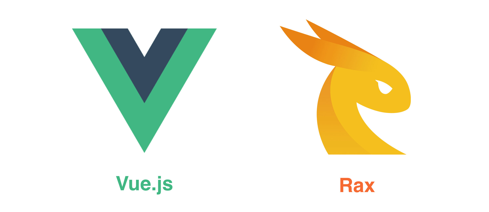

# What is Weex?

<!-- toc -->

> **Weex is a framework for building high-performance cross-platform mobile applications with a modern web development experience.**

> You can pronounce "*Weex*" as /wiːks/, just like "*Weeks*".

Weex enables developers to use modern web development skills to build Android, iOS, and Web apps with a single codebase. In practice, you can use JavaScript with modern front-end frameworks to develop mobile apps.

The structure of Weex is decoupled. The render engine is separated from the syntax layer(DSL). This means that Weex does not rely on any specific front-end framework or language. For now, Weex is widely used with the supports of [Vue.js](https://vuejs.org/) and [Rax](https://alibaba.github.io/rax/). Another primary goal of Weex is to keep up with modern development technologies and platform capabilities both for web and native. Productivity and performance can coexist in Weex. Write a Weex page is almost like writing a web page, even if the page is designated to run on native environment.

## Overview

To have a glance of the abilities of Weex, it is very simple.

* Install [WeexPlayground](http://weex.apache.org/tools/playground.html). In the playground you can try various demos.
* Visit [Weex online playground](http://dotwe.org/vue). On this site, you can write and run single page demos using Vue.js. And you can use WeexPlayground app to scan the demo.

Here is an [example](http://dotwe.org/vue/8da01827631b21150a12dd54d7114380) written in Weex and Vue.js which will give you an overall view of how Weex works:

In the `<template>` of the source code, you will notice the `
` element which is widely used on the web. It is also the generic container in Weex. The `<text>` component, however, is provided by Weex and is a block-level text container. All texts should be placed in `<text>` container and this is a difference from traditional HTML.

Within the `<style>` tag, you can write CSS to describe the styles of a component, and those styles are [**scoped**](https://vue-loader.vuejs.org/en/features/scoped-css.html) forcibly in Weex.

### Native Components

In the example above, the `
` and the `<text>` elements are rendered by native views on mobile device.

Weex implements render engines both on iOS and Android and provides a group of [built-in components](../docs/components/div.html). You can also write your own components wrapping native maps, videos, etc. Visit [Extend-iOS](./extend/extend-ios.html) or [Extend-Android](./extend/extend-android.html) for more details.

Behind the scenes, Weex uses native components and provides maximum uniformity for iOS and Android. But there exists slight differences for different platform. For example, the [`<switch>`](http://dotwe.org/vue/d96943452b6708422197c47920903823) component looks different on Android and iOS.

### Native Modules

For those features that do not rely on the UI views, Weex wraps them into **modules**, check [Animation Module](../docs/modules/animation.html) for an overview. In your front-end code, just use `weex.requireModule('xxx')` to import a module and you can call methods of it. Weex modules provide native capabilities for JavaScript, such as network, storage, clipboard, and navigator, etc. For example, you can use [`stream`](http://dotwe.org/vue/2ae062b6a04124a35bbe2da3b1e5c07b) module to fetch the star count of Vue.js.

Similarly, Weex provides a group of [built-in modules](../docs/modules/animation.html) for basic usage, and supports the integration of the existing native modules into the Weex platform. Visit the following documents for more details.

* [Extend Web Render](./extend/extend-web.html)
* [Extend Android](./extend/extend-android.html)
* [Extend iOS](./extend/extend-ios.html)

### Write Once, Run Everywhere

Yes, Weex enables developers to build apps for Android, iOS, and Web on a single codebase which dramatically increases development productivity and simplify the testing, building, and publishing processes.

Although a Weex page use single codebase, you can still write platform specific code. Weex provides `WXEnvironment` to get the current runtime environment. Check [Weex Variables](../docs/api/weex-variable.html) for more details.

## Using Front-End Frameworks

Front-end frameworks are the syntax layer of Weex. Weex never restricts to some specific front-end frameworks. For now [Vue.js](https://vuejs.org/) and [Rax](https://alibaba.github.io/rax/) are widely used in Weex development.

- **Vue.js** is a progressive front-end framework for building user interfaces.
- **Rax** is a front-end framework with React-compatible APIs.

> Vue.js and Rax are already integrated into Weex SDK.

It is possible to integrate your favorite front-end framework into Weex but it is not easy work. If you have any idea, you could contact us. You can read [Front-End Frameworks](./front-end-frameworks.html) for more details.

## Next Steps

At this point, you should have a general understanding of Weex. The next step is to explore and try the advanced features of Weex.

If you want to use weex to write your own app now, please read

- [Create a new app](./develop/create-a-new-app.html)
- [Integrate Weex to iOS](./develop/integrate-to-iOS-app.html)
- [Integrate Weex to Android](./develop/integrate-to-android-app.html)
- [Setup Development Environment](./develop/setup-develop-environment.html)

If you want to contribute to Weex code and documents, or commit a bug, please read

- [How to Contribute](./contribute/how-to-contribute.html)
- [Bug Report Guidelines](./contribute/bug-report-guidelines.html)
